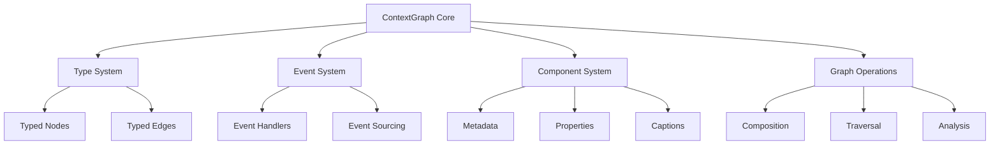

# ContextGraph Documentation

Welcome to the comprehensive documentation for the ContextGraph module of the Composable Information Machine (CIM).

## Documentation Index

### 1. [User Stories Documentation](./user-stories.md)
Detailed descriptions of all 20 user stories that demonstrate ContextGraph capabilities. Each story showcases specific functionality while incorporating core domain entities.

**Key Topics:**
- Core domain entities (People, Organizations, Agents, Locations, Documents, Policies, Workflows)
- Capability demonstrations for each user story
- Real-world scenario examples
- Feature mapping

### 2. [Test Documentation](./test-documentation.md)
Auto-generated documentation from the comprehensive test suite. Provides technical details about each test implementation.

**Key Topics:**
- Test structure (Given/When/Then)
- Test categories and coverage
- Running instructions
- Maintenance guidelines

### 3. [User Story Relationships](./user-story-relationships.md)
Visual guide showing how the 20 user stories relate to each other, their dependencies, and learning paths.

**Key Topics:**
- Story dependency graph
- Capability matrix
- Learning paths for different roles
- Integration points with other CIM modules

## Quick Start

### Understanding ContextGraph

ContextGraph is a powerful graph data structure that supports:
- **Typed nodes and edges** for domain modeling
- **Event-driven operations** for reactive systems
- **Component system** for rich metadata
- **Graph theory compliance** for algorithms
- **Domain entity composition** for business modeling

### Core Concepts

1. **Domain Entities**: All graphs work with People, Organizations, Agents, Locations, Documents, Policies, and Workflows
2. **Type Safety**: Strong typing throughout with Rust's type system
3. **Event-Driven**: Changes propagate through events
4. **Composable**: Graphs can be embedded and composed
5. **Theory-Compliant**: Supports graph theory, network theory, and category theory

### Running Tests

```bash
# Run all tests
cargo test --test comprehensive_contextgraph_tests

# Run specific user story test
cargo test --test comprehensive_contextgraph_tests test_user_story_1

# Generate updated test documentation
./scripts/generate-test-docs.sh
```

## Architecture Overview



## Use Cases

ContextGraph is designed for:

1. **Workflow Management**: Model business processes with states and transitions
2. **Knowledge Representation**: Create semantic graphs with concepts and relationships
3. **Event Flow Visualization**: Track event propagation through systems
4. **Organizational Modeling**: Represent people, roles, and structures
5. **Policy Enforcement**: Model access control and business rules
6. **Multi-Organization Collaboration**: B2B relationships and partnerships
7. **AI Agent Coordination**: Task assignment and knowledge aggregation

## Integration with CIM

ContextGraph integrates seamlessly with other CIM components:

- **cim-domain**: Compose domain entities into graphs
- **cim-ipld**: CID-based content addressing for graph elements
- **cim-subject**: Subject-based routing for graph events
- **cim-compose**: Higher-level graph composition patterns

## Contributing

When contributing to ContextGraph:

1. Follow the established user story pattern
2. Ensure tests include multiple domain entity types
3. Document with clear Given/When/Then structure
4. Update both user stories and test documentation
5. Maintain type safety and event-driven patterns

## Further Reading

- [CIM Architecture Overview](/doc/design/architecture.md)
- [Domain-Driven Design in CIM](/doc/design/ddd-patterns.md)
- [Event Sourcing Patterns](/doc/design/event-sourcing.md)
- [Graph Theory in CIM](/doc/research/graph-theory.md)
