# User Story Relationships

This document visualizes how the 20 user stories relate to each other and build upon shared capabilities.

## Story Dependency Graph

```mermaid
graph TD
    %% Core Foundation Stories
    US1[1. Typed Graph Creation]
    US2[2. Event-Driven Operations]
    US3[3. Component System]
    US4[4. Directional Edges]
    US5[5. Graph Composition]

    %% Theory and Analysis Stories
    US6[6. Graph Theory]
    US7[7. Invariant Enforcement]
    US8[8. Component Queries]
    US9[9. Network Analysis]
    US10[10. Category Theory]

    %% Domain Integration Stories
    US11[11. Domain Entities]
    US12[12. Workflow Graphs]
    US13[13. Concept Graphs]
    US14[14. Event Flow Graphs]
    US15[15. Domain Invariants]

    %% Applied Workflow Stories
    US16[16. Document Approval]
    US17[17. Agent Research]
    US18[18. Location Deployment]
    US19[19. Multi-Org Collab]
    US20[20. Access Control]

    %% Dependencies
    US1 --> US2
    US1 --> US3
    US1 --> US4
    US1 --> US5

    US4 --> US6
    US6 --> US9
    US6 --> US10

    US3 --> US8
    US7 --> US15

    US1 --> US11
    US11 --> US12
    US11 --> US13
    US11 --> US14

    US2 --> US12
    US2 --> US14

    US11 --> US16
    US11 --> US17
    US11 --> US18
    US11 --> US19
    US11 --> US20

    US12 --> US16
    US12 --> US17

    US3 --> US20
    US7 --> US20

    style US1 fill:#f9f,stroke:#333,stroke-width:4px
    style US2 fill:#f9f,stroke:#333,stroke-width:4px
    style US3 fill:#f9f,stroke:#333,stroke-width:4px
    style US11 fill:#9ff,stroke:#333,stroke-width:4px
```

## Story Categories

### Foundation Layer (Stories 1-5)
These stories establish the core capabilities:
- **Story 1**: Type system foundation
- **Story 2**: Event-driven architecture
- **Story 3**: Metadata and component system
- **Story 4**: Relationship modeling
- **Story 5**: Composition patterns

### Theory Layer (Stories 6-10)
These stories ensure mathematical and theoretical compliance:
- **Story 6**: Graph theory algorithms
- **Story 7**: Business rule enforcement
- **Story 8**: Query capabilities
- **Story 9**: Analytics and metrics
- **Story 10**: Category theory support

### Domain Layer (Stories 11-15)
These stories integrate domain concepts:
- **Story 11**: Core domain entity integration
- **Story 12**: Workflow state machines
- **Story 13**: Knowledge representation
- **Story 14**: Event sourcing visualization
- **Story 15**: Domain consistency

### Application Layer (Stories 16-20)
These stories demonstrate real-world applications:
- **Story 16**: Document management workflows
- **Story 17**: AI-assisted research
- **Story 18**: Infrastructure deployment
- **Story 19**: B2B collaboration
- **Story 20**: Security and compliance

## Capability Matrix

| Capability | Foundation | Theory | Domain | Application |
|------------|------------|--------|---------|-------------|
| Type Safety | 1, 4, 5 | 10 | 11 | All |
| Events | 2 | - | 14 | 16, 17 |
| Metadata | 3 | 8 | - | 20 |
| Composition | 5 | 10 | 12, 13 | 19 |
| Validation | - | 7 | 15 | 20 |
| Analysis | - | 6, 9 | - | 18 |

## Learning Path

### For New Developers
1. Start with Story 1 (Type System)
2. Learn Story 3 (Components)
3. Understand Story 11 (Domain Entities)
4. Try Story 16 (Document Workflow)

### For Graph Theory Experts
1. Review Story 6 (Graph Theory)
2. Explore Story 9 (Network Analysis)
3. Deep dive into Story 10 (Category Theory)
4. Apply to Story 13 (Concept Graphs)

### For Business Analysts
1. Focus on Story 11 (Domain Entities)
2. Study Stories 16-20 (Applications)
3. Understand Story 12 (Workflows)
4. Review Story 7 & 15 (Business Rules)

### For System Architects
1. Master Story 2 (Event-Driven)
2. Understand Story 5 (Composition)
3. Study Story 14 (Event Flows)
4. Design with Stories 18-19 (Distributed Systems)

## Integration Points

### With cim-domain
- Story 11 directly integrates domain entities
- Stories 16-20 use domain concepts extensively

### With Event Sourcing
- Story 2 establishes event patterns
- Story 14 visualizes event flows
- Story 15 maintains event consistency

### With AI/Agents
- Story 17 demonstrates agent integration
- Story 13 provides knowledge representation
- Story 9 enables influence analysis

### With Security/Policy
- Story 3 provides metadata foundation
- Story 7 enforces invariants
- Story 20 implements access control
